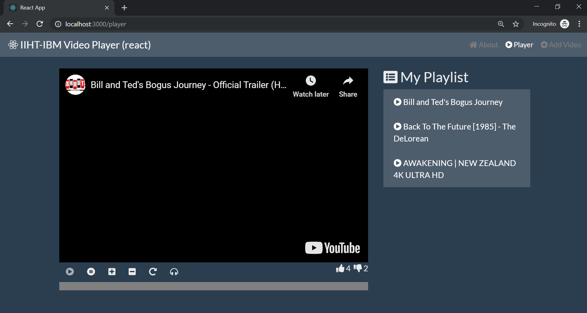
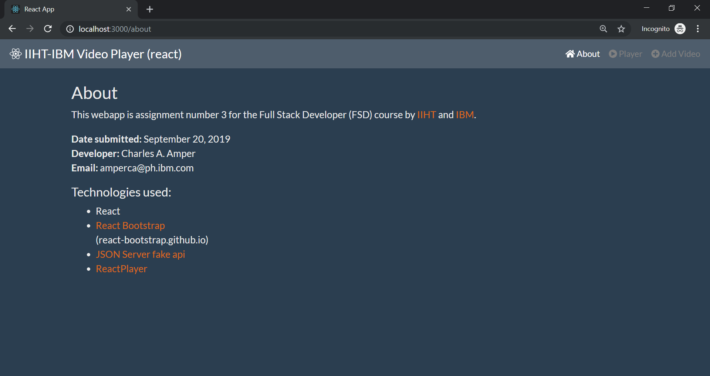
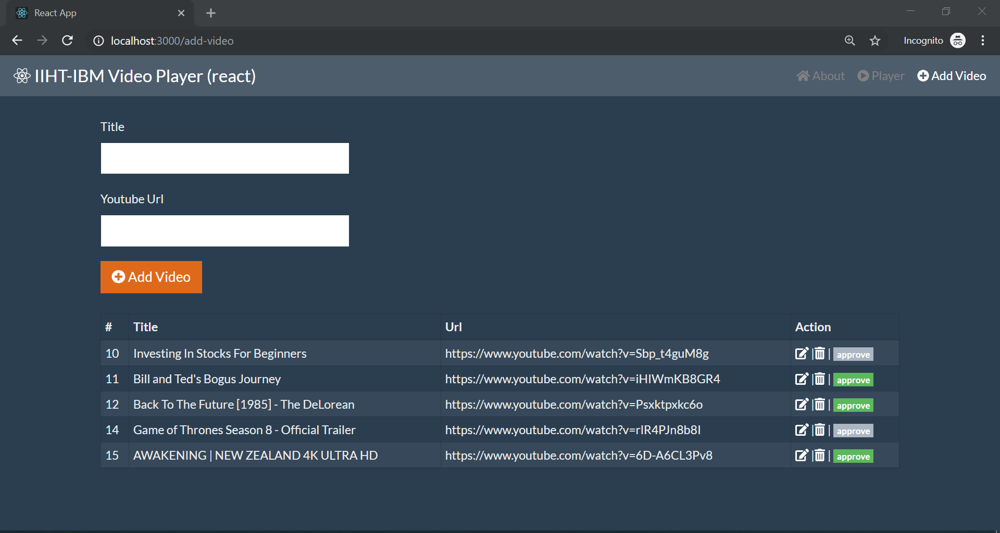
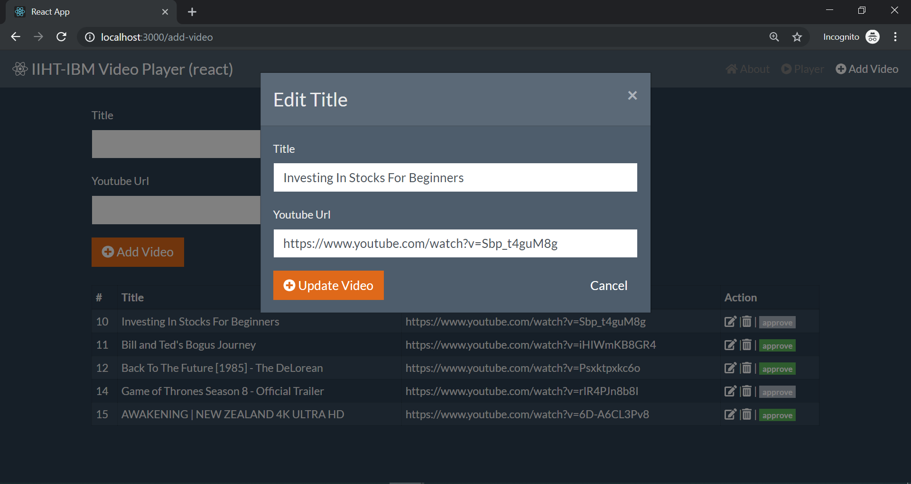
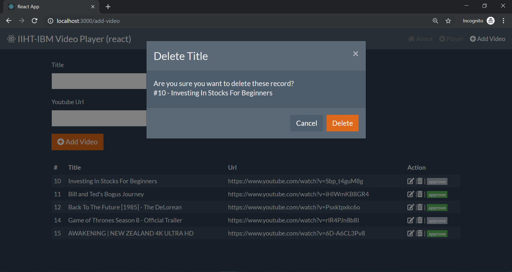

# About

This webapp is assignment number 3 for the Full Stack Developer (FSD) course by IIHT and IBM.

## Built With
* [React](https://reactjs.org)
* [React Bootstrap](https://react-bootstrap.github.io)
* [JSON Server fake Rest API](https://github.com/typicode/json-server)
* [ReactPlayer](https://www.npmjs.com/package/react-player)

## Author
* **Charles Amper**

* **Date submitted** : September 20, 2019
* **Training date** : December 2018 - ongoing

## Installing
### prerequisite

Install 
JSON FAKE API 

```
npm install -g json-server
```
### Steps

1. Run
```
  git clone https://github.com/talbhoggs/iiht-ibm-training3.git
```
2. In the root folder in step 1 run 
```
  npm install
```
3. Once installed. Open two terminals (bash or cmd) in the root folder  
* For terminal 1:  
Run
 ```
   npm start
 ```
* For terminal 2:  
Run
 ```
   json-server --watch database.json --port 3001
 ```

 4. Run this by opening your favorite web browser.

UI:
 ```
   http://localhost:3000
 ```
Fake REST:
 ```
   http://localhost:3001/playlist
 ```

**Congratulations your done!**

## Screenshots

### Player page


### About page


### Add Video page


### Edit modal


### Delete modal

